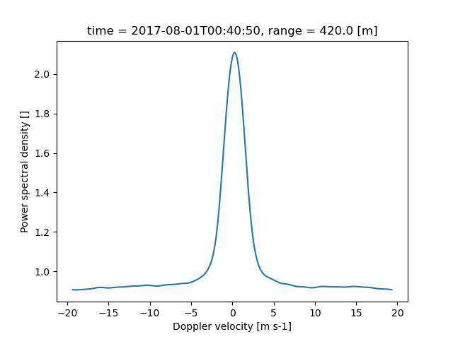
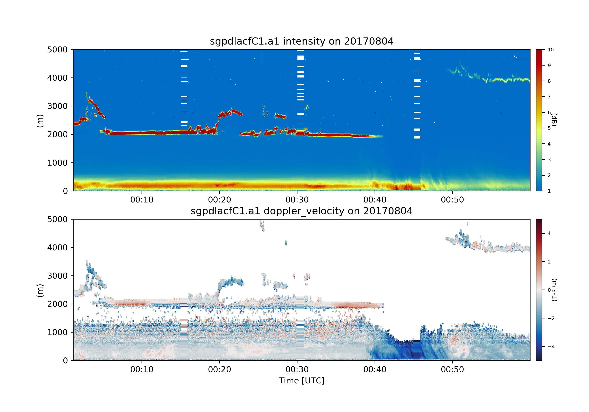

============
Using HighIQ
============

Input and Output
----------------
HighIQ uses NetCDF files as its inputs. Currently, the I/O module supports NetCDF
files that conform to Atmospheric Radiation Measurement standards. Therefore, in
order to place data into a format supported by HighIQ, a data ingest must be
able to place the data in xarray datasets that contain 3D variables that have
dimensions of (*time*, *nsamples*, *complex*). These dimensions are defined as:

    * *time* = the number of samples in time
    * *nsamples* = the number of given samples for a ray
    * *complex* = index 0 is real component of ACF, 1 is imaginary component.

The *complex* dimension will always be of length 2. This array will store the ACF
for the radar or lidar signal. In addition, HighIQ also expects a background ACF
for determining the noise floor of the instrument. This background ACF array will
have the same dimensions as the ACF array.

After the acf array has been created (or loaded using xarray.open_dataset), the
next step is to create the Doppler spectra using :func:`highiq.calc.get_psd`::

    $ my_ds = highiq.calc.get_psd(my_ds)

Read the documentation on :func:`highiq.calc.get_psd` in order to learn how to
customize parameters such as the size of the range gate, sampling frequency, and
number of points to include in the FFT. This function will add Doppler spectra
variables 'power_spectra_density' which contains the power spectral density in
:math:`dB\ m\ s^{-1}` and 'power_spectra_density_normed' which is normalized
such that the integral under the curve is 100%. The power spectra density are defined
at *nfft* points between the negative and positive Nyquist velocities of the
radar or lidar.

However, while *nfft* can be the optimal number of points to include in
the FFT, for a robust calculation of moments, interpolation of the Doppler spectra
are required. Therefore, In addition, HighIQ will interpolate the Doppler spectra
generated over the original *nfft* point space in order to provide smoother Doppler
spectra more suitable for the calculation of the moments of the spectra.

After these Doppler spectra are created, the calculation of the lidar moments is as
easy as::

    $ my_moments = highiq.calc.get_lidar_moments(my_ds)

Optimizing processing
---------------------
For both the processing of the Doppler spectra and moments, HighIQ will only store
a portion of the dataset in the GPU's memory due to limitations. However, if you
have a high amount of GPU memory, you may be able to optimize the processing
by increasing the *block_size_ratio* keyword of both :func:`highiq.calc.get_lidar_moments` and
:func:`highiq.calc.get_psd`.

Plotting Spectra
----------------
Since the output arrays are xarray Datasets, the standard xarray plotting routines
can be used to make visualizations. For example, in order to plot the Doppler spectra
from the example file, we simply do::

   $ # Load the data. This uses a module in the Atmospheric Community
   $ # Toolkit to ensure that the input acf data are always
   $ # entered into a 3D array of (time, nsamples, complex)
   $
   $ my_ds = highiq.io.load_arm_netcdf(highiq.testing.TEST_FILE)
   $ my_ds_processed = highiq.calc.get_psd(my_ds)
   $
   $ # For plotting the spectra, simply use xarray's built in functionality
   $ #
   $ my_ds_processed.power_spectra_normed_interp.sel(range=400, method='nearest').plot()

The above example chooses the range gate that is 400 m away from the radar and will plot
the Doppler spectra at that point. In this example, we are using the single test data point
file that is contained within HighIQ's test file. For files with multiple time periods,
selecting by time period is as easy as specifying a time keyword to the *sel* function in last line in
the above example. The format of this time is a *datetime*, so selecting 2018-08-01 00:40:00 UTC would mean
adding a :code:`time=datetime(2018, 8, 1, 0, 40, 0)` to the list of keywords.

Plotting 2D time series
-----------------------
2D Visualization of spectra is easily done using the `Atmospheric Community Toolkit
(ACT) <https://arm-doe.github.io/ACT>`_. One is encouraged to read the documentation
and `examples <https://arm-doe.github.io/ACT/source/auto_examples/index.html>`_
from ACT in order to learn how to create custom visualizations. For the
majority of vertically-pointing observations, ACT's TimeSeriesDisplay object provides
the functionality needed to create quicklook plots of the retrieved lidar moments.
For example, in order to plot the radar moments from the example
`file <https://drive.google.com/uc?export=download&id=1x7pT4K05wJufepBR_26N1wpLzCoEEr9H>`_, simply
do::

   $ import highiq
   $ import act
   $ my_ds = highiq.io.load_arm_netcdf('sgpdlacfC1.a1.20170804.000113.nc.v0')
   $ my_ds = highiq.calc.get_psd(my_ds)
   $ my_ds = highiq.calc.get_lidar_moments(my_ds)
   $ # Make a stricter mask for Doppler velocity to favor excluding more noise
   $ my_ds['doppler_velocity'] = my_ds['doppler_velocity'].where(my_ds.intensity > 1.2)

   $ # With ACT, we set up a TimeSeriesDisplay object with two sub plots
   $ my_display = act.plotting.TimeSeriesDisplay(my_ds, figsize=(10,7), subplot_shape=(2,))

   $ # The plot function takes in the same kwargs as matplotlib's plotting routines
   $ my_display.plot('intensity', subplot_index=(0,), cmap='act_HomeyerRainbow', vmin=1, vmax=10)
   $ my_display.plot('doppler_velocity', subplot_index=(1,), cmap='act_balance', vmin=-5, vmax=5)
   $ my_display.set_yrng([0, 5000], subplot_index=(0,))
   $ my_display.set_yrng([0, 5000], subplot_index=(1,))
   $ my_display.fig.savefig('spectra_difference.png', dpi=300)

This code will make two subplots that look like the image above.